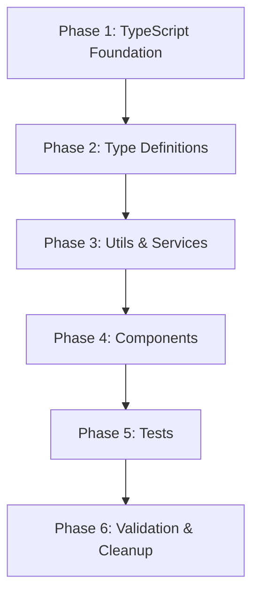

# Tasks: TypeScript Migration for Crypto DCA Simulator

**Feature**: 002-typescript-migration  
**Parent Feature**: 001-crypto-dca-simulator  
**Input**: Constitution v1.1.0 mandate, existing JavaScript codebase  
**Prerequisites**: Current JavaScript implementation (Phase 3 MVP complete)

**Purpose**: Migrate crypto-dca-simulator from JavaScript to TypeScript to comply with Constitution v1.1.0 which mandates TypeScript for all JS/Node.js projects.

**Organization**: Tasks are organized by migration phase to ensure type safety is achieved incrementally with continuous validation.

## Format: `[ID] [P?] [Story] Description`
- **[P]**: Can run in parallel (different files, no dependencies)
- **[TSM]**: TypeScript Migration story marker

## Dependencies & Execution Order

**Critical Path**: Phase 1 → Phase 2 → Phase 3 → Phase 4 → Phase 5 → Phase 6

**Parallel Opportunities**:
- Phase 2: All type definition files can be created in parallel
- Phase 3: Utils migration can run parallel to services migration (within constraints)
- Phase 4: Component migrations can run parallel after shared types are complete
- Phase 5: Test migrations can run parallel once their source files are migrated

---

## Phase 1: TypeScript Foundation (4 tasks)

**Purpose**: Install TypeScript infrastructure and configure strict mode per Constitution requirements

**Critical Requirements**:
- Constitution mandates `strict: true` in tsconfig.json
- Zero implicit `any` types allowed
- 95% minimum type coverage target

### Setup & Configuration

- [ ] T001 Install TypeScript dependencies: `npm install --save-dev typescript @types/react @types/react-dom @types/node @types/jest`
- [ ] T002 Create tsconfig.json with Constitution-compliant strict configuration (strict: true, noImplicitAny: true, strictNullChecks: true)
- [ ] T003 [P] Install additional type definition packages: `npm install --save-dev @types/chart.js @testing-library/jest-dom @testing-library/react`
- [ ] T004 Update package.json scripts to include TypeScript type checking: add `"type-check": "tsc --noEmit"` and `"type-check:watch": "tsc --noEmit --watch"`

**Gate**: After this phase, `npm run type-check` should run successfully (no errors expected yet, only checking configuration)

---

## Phase 2: Type Definitions & Interfaces (8 tasks)

**Purpose**: Create comprehensive TypeScript type definitions matching data-model.md contracts

**Critical Requirements**:
- All interfaces must match data-model.md specifications exactly
- Export all types for use across codebase
- Document complex types with JSDoc comments

### Core Type Definitions

- [ ] T005 [P] [TSM] Create src/types/simulation.types.ts with SimulationConfig interface and DCAFrequency type
- [ ] T006 [P] [TSM] Create src/types/price.types.ts with PriceDataPoint interface
- [ ] T007 [P] [TSM] Create src/types/purchase.types.ts with DCAPurchase interface
- [ ] T008 [P] [TSM] Create src/types/results.types.ts with SimulationResults interface
- [ ] T009 [P] [TSM] Create src/types/cache.types.ts with CacheEntry and CacheMetadata interfaces
- [ ] T010 [P] [TSM] Create src/types/api.types.ts with ApiResponse, ApiError, and CoinGeckoResponse interfaces
- [ ] T011 [P] [TSM] Create src/types/validation.types.ts with ValidationResult and ValidationError interfaces
- [ ] T012 Create src/types/index.ts as central export point for all type definitions

**Gate**: All type files should compile without errors: `tsc --noEmit`

---

## Phase 3: Utils & Services Migration (12 tasks)

**Purpose**: Migrate utility functions and service layer to TypeScript with full type safety

**Critical Requirements**:
- All function parameters must have explicit types
- All return types must be explicitly declared
- No `any` types without justification
- 100% coverage for dcaCalculator (Constitution requirement)

### Utilities Migration

- [ ] T013 [P] [TSM] Migrate src/utils/validators.js to src/utils/validators.ts with explicit ValidationResult return types
- [ ] T014 [P] [TSM] Migrate tests/unit/validators.test.js to tests/unit/validators.test.ts
- [ ] T015 [P] [TSM] Migrate src/utils/formatters.js to src/utils/formatters.ts with string/number return type annotations
- [ ] T016 [P] [TSM] Migrate tests/unit/formatters.test.js to tests/unit/formatters.test.ts
- [ ] T017 [P] [TSM] Migrate src/utils/dateHelpers.js to src/utils/dateHelpers.ts with Date and string type parameters
- [ ] T018 [P] [TSM] Migrate tests/unit/dateHelpers.test.js to tests/unit/dateHelpers.test.ts

### Services Migration

- [ ] T019 [TSM] Migrate src/services/cacheManager.js to src/services/cacheManager.ts implementing CacheEntry types
- [ ] T020 [TSM] Migrate tests/unit/cacheManager.test.js to tests/unit/cacheManager.test.ts
- [ ] T021 [TSM] Migrate src/services/priceApi.js to src/services/priceApi.ts with PriceDataPoint[] return types
- [ ] T022 [TSM] Migrate src/services/dcaCalculator.js to src/services/dcaCalculator.ts with SimulationResults return type (CRITICAL: 100% coverage required)
- [ ] T023 [TSM] Migrate tests/unit/dcaCalculator.test.js to tests/unit/dcaCalculator.test.ts maintaining 100% coverage
- [ ] T024 [TSM] Run type-check and fix any type errors revealed in utils/services: `npm run type-check`

**Gate**: After this phase:
- All utils and services compile without type errors
- All unit tests pass: `npm test -- src/utils src/services`
- dcaCalculator maintains 100% test coverage

---

## Phase 4: React Components Migration (10 tasks)

**Purpose**: Migrate React components to TypeScript with proper prop types and component typing

**Critical Requirements**:
- All React components must use TypeScript's JSX typing (React.FC or explicit return types)
- All props interfaces must be defined
- Event handlers must have explicit types
- State hooks must have explicit type parameters

### Component Type Definitions

- [ ] T025 [P] [TSM] Create src/components/types/SimulatorForm.types.ts with SimulatorFormProps and FormState interfaces
- [ ] T026 [P] [TSM] Create src/components/types/ChartDisplay.types.ts with ChartDisplayProps and ChartConfig interfaces
- [ ] T027 [P] [TSM] Create src/components/types/ResultsSummary.types.ts with ResultsSummaryProps interface

### Component Migrations

- [ ] T028 [TSM] Migrate src/components/SimulatorForm.js to src/components/SimulatorForm.tsx with typed props and state hooks
- [ ] T029 [TSM] Migrate tests/unit/SimulatorForm.test.js to tests/unit/SimulatorForm.test.tsx
- [ ] T030 [TSM] Migrate src/components/ChartDisplay.js to src/components/ChartDisplay.tsx with Chart.js TypeScript types
- [ ] T031 [TSM] Migrate tests/unit/ChartDisplay.test.js to tests/unit/ChartDisplay.test.tsx
- [ ] T032 [TSM] Migrate src/components/ResultsSummary.js to src/components/ResultsSummary.tsx with typed props
- [ ] T033 [TSM] Migrate tests/unit/ResultsSummary.test.js to tests/unit/ResultsSummary.test.tsx
- [ ] T034 [TSM] Run type-check and fix any type errors revealed in components: `npm run type-check`

**Gate**: After this phase:
- All components compile without type errors
- All component tests pass: `npm test -- src/components`
- React prop types are fully typed (no PropTypes package needed)

---

## Phase 5: Application & Test Infrastructure (8 tasks)

**Purpose**: Migrate application entry points and remaining test infrastructure

**Critical Requirements**:
- App.tsx must properly type all state management
- Integration tests must use TypeScript-aware test utilities
- Vite configuration must support TypeScript

### Application Migration

- [ ] T035 [TSM] Migrate src/App.js to src/App.tsx with typed state management and component props
- [ ] T036 [TSM] Migrate src/index.js to src/index.tsx (React root entry point)
- [ ] T037 [TSM] Update vite.config.js to vite.config.ts with proper TypeScript configuration
- [ ] T038 [TSM] Update jest.config.js to jest.config.ts with ts-jest preset configuration

### Integration Test Migration

- [ ] T039 [P] [TSM] Migrate tests/integration/basic-simulation.test.js to tests/integration/basic-simulation.test.ts
- [ ] T040 [P] [TSM] Migrate tests/contract tests to TypeScript (if they exist)
- [ ] T041 [TSM] Install @types/testing-library__user-event if not already installed
- [ ] T042 [TSM] Run full test suite and verify all tests pass: `npm test`

**Gate**: After this phase:
- Full application compiles with zero TypeScript errors: `tsc --noEmit`
- All tests pass: `npm test`
- Application runs in dev mode: `npm run dev`

---

## Phase 6: Validation, Documentation & Cleanup (12 tasks)

**Purpose**: Ensure Constitution compliance, achieve 95% type coverage, and clean up migration artifacts

**Critical Requirements**:
- Constitution Gate: `tsc --noEmit` must pass with zero errors
- Constitution Gate: 95% minimum type coverage
- Constitution Gate: No `any` types without justification
- Constitution Gate: All tests pass with coverage thresholds met

### Type Coverage & Quality

- [ ] T043 [TSM] Install type coverage tool: `npm install --save-dev type-coverage`
- [ ] T044 [TSM] Add type coverage script to package.json: `"type-coverage": "type-coverage --at-least 95"`
- [ ] T045 [TSM] Run type coverage analysis and identify gaps: `npm run type-coverage`
- [ ] T046 [TSM] Fix any type coverage gaps below 95% threshold (add explicit types, remove unnecessary `any`)
- [ ] T047 [TSM] Audit codebase for `any`, `@ts-ignore`, `@ts-expect-error` usages and document justifications

### Build & Configuration Cleanup

- [ ] T048 [TSM] Remove all JavaScript source files (.js) after verifying TypeScript equivalents (.ts/.tsx) work correctly
- [ ] T049 [TSM] Update .eslintrc.json to use @typescript-eslint/parser and @typescript-eslint/eslint-plugin
- [ ] T050 [TSM] Install and configure ESLint TypeScript plugins: `npm install --save-dev @typescript-eslint/parser @typescript-eslint/eslint-plugin`
- [ ] T051 [TSM] Run ESLint on TypeScript files and fix violations: `npm run lint`

### Documentation & CI Updates

- [ ] T052 [TSM] Update README.md to reflect TypeScript usage (installation, type checking commands, development workflow)
- [ ] T053 [TSM] Update package.json to specify main entry as src/index.tsx and include type definitions
- [ ] T054 [TSM] Add pre-commit hook to run type checking: `npm run type-check` in git pre-commit

**Final Gate - Constitution Compliance**:
- ✅ `tsc --noEmit` passes with zero errors (Constitution: Zero Type Errors)
- ✅ `npm run type-coverage` shows >= 95% (Constitution: 95% Type Coverage)
- ✅ `npm test` passes with coverage >= 80% (general) and 100% (dcaCalculator) (Constitution: Testing Standards)
- ✅ `npm run lint` passes (Constitution: Quality Gates)
- ✅ No `.js` source files remain except configuration files (Constitution: TypeScript Required)
- ✅ tsconfig.json has `"strict": true` (Constitution: Strict Mode Required)

---

## Summary

**Total Tasks**: 54 tasks across 6 phases

**Task Breakdown by Phase**:
- Phase 1 (Foundation): 4 tasks
- Phase 2 (Type Definitions): 8 tasks  
- Phase 3 (Utils & Services): 12 tasks
- Phase 4 (Components): 10 tasks
- Phase 5 (Application): 8 tasks
- Phase 6 (Validation): 12 tasks

**Parallel Opportunities**: 19 tasks marked with [P] can run in parallel (35% of tasks)

**Estimated Timeline**: 8-12 hours for complete migration
- Phase 1: 1 hour
- Phase 2: 1.5 hours
- Phase 3: 3 hours
- Phase 4: 2.5 hours
- Phase 5: 2 hours
- Phase 6: 2 hours

**Critical Success Factors**:
1. Strict mode TypeScript from day 1 (no gradual adoption)
2. 100% test coverage maintained for dcaCalculator during migration
3. No `any` escape hatches without documentation
4. Type-check passes at end of each phase before proceeding
5. All Constitution gates verified before declaring complete

**Constitution Compliance**: This migration satisfies Constitution v1.1.0 Principle I (Code Quality - Type Safety) by converting the crypto-dca-simulator from JavaScript to TypeScript with strict mode enabled, 95% type coverage, and zero type errors.

**Independent Testing Strategy**: Each phase has a clear gate that can be independently verified:
- Phase 1: Configuration compiles
- Phase 2: Type definitions compile
- Phase 3: Utils/services compile + tests pass
- Phase 4: Components compile + tests pass  
- Phase 5: Full app runs + all tests pass
- Phase 6: Constitution gates all pass

**Migration Approach**: Bottom-up migration starting with types and utilities, moving up through services to components, ensuring each layer is fully typed before depending layers are migrated. This approach maintains working code throughout the migration with continuous type checking validation.
